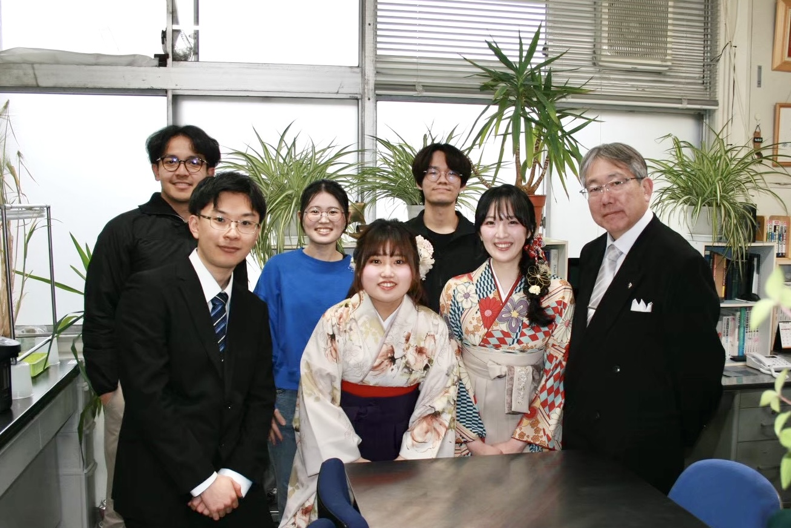

---
---

# 木藤研究室へようこそ - Welcome to Kidou Lab

遺伝子やタンパク質の機能解析を通じて、あなたも美しい生命現象の謎解きに参加しませんか？
 
Join us in unraveling the beautiful mysteries of life phenomena through the functional analysis of genes and proteins.
  
オオムギは、ビールやウイスキーの主原料として利用されているだけでなく、日本では麦茶や麦ご飯としても利用されています。また、食物繊維であるβ-グルカンを豊富に含むことから、健康食品としても着目されています。また、オオムギは低温をはじめとする環境ストレスに耐性を持つことから、コムギの栽培に適さない寒冷地である北欧でも栽培できるという特徴を持っています。私たちの研究室では、このオオムギが持つ低温耐性の仕組みとβ-グルカンを合成する仕組みを分子レベルで解き明かす研究に着手しています。また、モデル植物であるシロイヌナズナを用いて、花芽形成の研究にも挑んでいます。教員が一人しかいない小さな研究室ですが、地道に植物の生理機構を分子レベルで解き明かす研究に取り組んでいます。植物に興味がある方は、是非私たちの研究室のメンバーに加わって下さい。
  
Barley is not only used as a main ingredient in beer and whiskey, but is also enjoyed in Japan as barley tea and barley rice. Additionally, because it is rich in the dietary fiber β-glucan, it is attracting attention as a health food. Barley is also highly tolerant to environmental stresses, particularly cold temperatures, allowing it to be cultivated in cold regions like Northern Europe where wheat cannot thrive. In our laboratory, we are working to unravel the molecular mechanisms behind barley's cold tolerance and β-glucan synthesis. We are also conducting research on floral bud formation using the model plant *Arabidopsis thaliana*. Although we are a small laboratory, we are working to elucidate the physiological mechanisms of plants at the molecular level. If you have an interest in plants, we warmly invite you to join our team!

 

